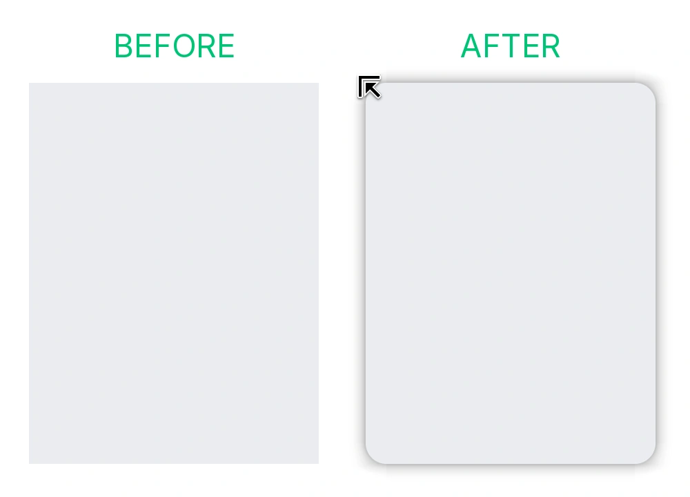

<div align="center">


# Window Nativizer

**Seamlessly nativize non-native applications into the GNOME desktop.**

[English](README.md) | [简体中文](README.zh-CN.md)

<p>
  <a href="https://github.com/everyx/gnome-shell-extension-window-nativizer/actions/workflows/ci.yml"></a>
  
  
</p>

<p>
Brings authentic Adwaita rounded corners, GPU-baked shadows, and GTK-standard resize ergonomics to non-conforming windows (Qt, GTK3, Wine, custom CSD applications, etc.).
</p>



</div>

---

## Key Features

### 🎯 Authentic Libadwaita Styling
Non-native apps often feel out of place on a modern GNOME desktop. Window Nativizer brings them in line with official styling:
- **Standard Adwaita corners** with subtle inner outline highlights
- **Multi-layer Gaussian shadows** matching libadwaita layer for layer
- **Every native window state**: Rounded and shadowed when focused, the lighter backdrop shadow when unfocused, a hairline ring in the theme's colour when tiled, nothing when maximized or fullscreen
- **High contrast aware**: Follows the system contrast setting and deepens the outline
- Curves and metrics compiled directly from upstream GNOME sources

### 🖱️ Effortless Drag-to-Resize Ergonomics
Visual rounding is only half the story — non-native windows often have paper-thin borders that are nearly impossible to grab. Window Nativizer fixes window ergonomics from the ground up:
- **No pixel hunting**: Expands 0~1px borders into a comfortable invisible grab area aligned with GTK's native input region
- **Smooth Corner Reach**: Follows GTK's corner coordinate heuristics, so diagonal resizing doesn't slip
- **Native Mutter Grab-Ops**: Triggers compositor-level resize grabs and dynamic 8-way directional cursors without lag
- **Non-Intrusive**: Only covers the outer perimeter — never intercepts client titlebar drags, window buttons, or tab clicks

### ⚡ Smooth GPU Shaders
- **Pre-baked GPU shadow meshes**: No CSS re-layout overhead at runtime
- **Direct pipeline hook**: Corners stay locked to the window during live resize without lag
- **Transitions that follow focus**: The shadow fades to the backdrop set when focus leaves and snaps back when it returns, the way upstream declares it; the same opacity tracks GNOME Shell's close animation
- **Follows the animation setting**: With animations off the fade snaps as well
- **Low resource footprint**: Lightweight GPU execution with minimal memory usage and zero-overdraw culling

### 🛡️ Smart & Non-Invasive
- **Leaves native apps alone**: Automatically skips Libadwaita, Libhandy, and Firefox
- **No double shadows**: Identifies existing compositor shadows and supplements only what is missing
- **Overview-aware**: Suspends corner clipping during GNOME Shell overview mode to keep downscaled window previews sharp
- **Clean tile seams**: The edge shared with another tile gets no ring, so no doubled line appears where two tiles meet

### 🔍 Crisp Text Protection
Fractional display scaling (125%, 150%) often causes font blurriness in traditional corner extensions due to offscreen framebuffer limitations.
- **Prioritize crisp text**: An optional toggle that bypasses corner clipping on scaled displays to keep text sharp
- **Tracking upstream Mutter**: Preparing for direct rendering that keeps both the corners and the sharp text, once upstream Mutter [!5179](https://gitlab.gnome.org/GNOME/mutter/-/merge_requests/5179) lands

---

## Comparison: Window Nativizer vs. Rounded Window Corners

| Feature | Rounded Window Corners (Reborn) | Window Nativizer |
| :--- | :--- | :--- |
| **Primary Goal** | Desktop theming & custom aesthetics | GNOME / Adwaita native consistency |
| **Target Scope** | Rounds all windows (opt-out / blacklist) | Decorates non-native windows only; leaves native apps untouched |
| **Corner Radius** | User-configurable (e.g. 12px, 16px, 20px) | Authentic curvature matching official Libadwaita |
| **Resize & Drag Ergonomics** | Retains application's declared border (often 0~1px, frustrating to grab) | Adds GTK-standard grab margins outside the window, with 8-way directional cursors |
| **Shadow Pipeline** | St.Bin CSS layout tree | GPU-baked texture mesh |

---

## Corrections

Window Nativizer automatically handles most applications, but you can correct its judgement per window:

Each correction names the axes — **Corners**, **Shadow**, **Resize** — whose automatic decision is wrong for that window, and the extension does the opposite on those axes. An axis the correction does not name keeps following the decision, so a correction is always a real change rather than a restatement of what already happens.

| Corrected axis | Typical Use Case |
| :--- | :--- |
| Nothing | Default. The automatic decision stands; most windows need no correction at all |
| Corners | Round a window the decision left alone, or stop rounding one our rounding breaks (artifacts, native look preferred) |
| Shadow | Cast ours where the decision left the client's, or retract ours (common on X11, where Mutter paints one) |
| Resize | Retract the band on a fixed-ratio popup it cannot track, or add it where the decision read the window's own handle as native (GTK4 wide margins) |

To correct a window that looks wrong, open **Preferences** and click **Pick window…** in **Corrections**.

[Learn more about the rule model →](docs/rule-model.md)

---

## Installation

### Requirements
- GNOME Shell 50, 51 (Wayland or X11)

### From Release (Recommended)
Download `window-nativizer@everyx.github.io.shell-extension.zip` from [GitHub Releases](https://github.com/everyx/gnome-shell-extension-window-nativizer/releases):

```sh
gnome-extensions install --force window-nativizer@everyx.github.io.shell-extension.zip
```

### From Source
```sh
git clone https://github.com/everyx/gnome-shell-extension-window-nativizer.git
cd gnome-shell-extension-window-nativizer
pnpm install
pnpm run install-ext
```

### Enable
Log out and back in (on X11, press `Alt+F2` and run `r`), then enable:
```sh
gnome-extensions enable window-nativizer@everyx.github.io
```

---

## Going Further

This extension only fixes the window frame. What's inside — title bar, buttons, menus — comes from
the app's own theme, and no window decoration can change it. For that:

- **[adw-gtk3](https://github.com/lassekongo83/adw-gtk3)** for GTK3 apps — an unofficial GTK3 port of
  libadwaita.
- **[Legacy Theme Scheme Auto Switcher](https://extensions.gnome.org/extension/4998/legacy-gtk3-theme-scheme-auto-switcher/)**
  so GTK3 apps follow dark mode.
- **[QAdwaitaDecorations](https://github.com/FedoraQt/QAdwaitaDecorations)** for Qt apps — Adwaita-style
  title bars.

Electron, Wine, Java and GTK4 apps that aren't libadwaita have their own projects; adw-gtk3's README
keeps a [list](https://github.com/lassekongo83/adw-gtk3#related-projects).

---

## Architecture & Documentation

For low-level implementation details, design decisions, and benchmarks:
- [Decoration & Shader Architecture](docs/decoration-model.md) — GPU meshes, pipeline hooks, and memory budgets
- [Pixel Alignment & Accuracy](docs/decoration-alignment.md) — Upstream Libadwaita curve matching and regression tests
- [Rule System](docs/rule-model.md) — Process heuristics, window types, and rule precedence
- [Development & Testing Guide](docs/development.md) — Environment setup and test suite execution

---

## License

Licensed under **GPL-2.0-or-later**.
- Metrics and styling generated from [libadwaita](https://gitlab.gnome.org/GNOME/libadwaita), shadows derived from [GTK4](https://gitlab.gnome.org/GNOME/gtk), window behaviors aligned with [Mutter](https://gitlab.gnome.org/GNOME/mutter).
- Related project reference: [Rounded Window Corners Reborn](https://github.com/flexagoon/rounded-window-corners).
