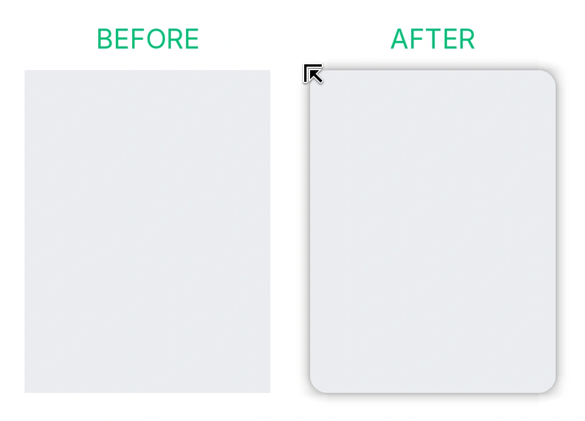

<div align="center">


# Window Nativizer

**让非原生应用无缝融入 GNOME 桌面。**

[English](README.md) | [简体中文](README.zh-CN.md)

<p>
  <a href="https://github.com/everyx/gnome-shell-extension-window-nativizer/actions/workflows/ci.yml"></a>
  
  
</p>

<p>
为所有未遵循 Adwaita 样式的第三方窗口（Qt, GTK3, Wine, 各类自绘 CSD 应用等）带来官方对齐的圆角、GPU 烘焙阴影以及与 GTK 原生一致的窗口调整大小体验。
</p>



</div>

---

## 核心特性

### 🎯 原汁原味的 Libadwaita 规范
拒绝肉眼调参。视觉指标直接从 GNOME / Libadwaita 官方源码编译生成：
- **原生标准圆角** 与内侧细腻微光轮廓
- **多层高斯阴影**，深度贴合深色与浅色主题
- 完美契合 GNOME 整体视觉风格

### 🖱️ 丝滑的原生拖拽调整大小手感
圆角只是视觉的一半，非原生窗口最折磨人的是“边框太窄极难拉伸”。Window Nativizer 从交互人体工学上彻底解决这一痛点：
- **告别像素级微操**：将许多第三方窗口难以瞄准的 0~1px 边缘，扩展为与 GTK 原生完全一致的隐形舒适抓取区
- **斜向拉伸不脱手**：忠实复刻 GTK 拐角坐标捕获算法，拐角拖拽判定范围大幅拓宽，顺滑自然
- **Mutter 原生拖拽联动**：直接触发合成器级 8 向原生调整大小手势（Grab-Op）与自适应光标，零撕裂零延迟
- **绝不误触**：抓取区严格位于窗口外围，绝不侵占内部标题栏拖拽、窗口控制按钮或浏览器标签页点击

### ⚡ 平滑流畅的 GPU 着色器
- **GPU 阴影纹理预烘焙**：运行期零 CSS 解析重排开销
- **管线直连挂钩**：连续拉伸窗口时圆角零延迟、无撕裂
- **退出动效无缝淡出**：阴影管线透明度实时同步 GNOME Shell 关闭与最小化动画，彻底消灭生硬的阴影闪烁
- **超轻资源开销**：全透明时自动剔除着色（Zero Overdraw），单窗显存与内存增量极小

### 🛡️ 智能识别与非侵入设计
- **不打扰原生应用**：自动识别并跳过 Libadwaita、Libhandy 与 Firefox
- **消除多层阴影**：精确识别 Mutter 与系统既有阴影，只补缺失部分
- **Overview 视图自适应**：进入 GNOME Shell Overview 时自动挂起圆角裁剪，防止缩略图出现发虚与边缘锯齿
- **状态感知**：窗口最大化、全屏或分屏贴边对齐时，自动撤销外侧多余装饰与接缝阴影

### 🔍 分数缩放文字清晰度保护
传统圆角插件在 125%、150% 等分数缩放屏幕下容易导致全窗文字发虚。
- **“优先清晰文本”选项**：缩放屏幕下自动跳过圆角离屏裁剪，完整保留锐利文字与 GPU 阴影
- **紧跟 Mutter 上游根治方案**：紧密跟踪并适配上游修复（[!5179](https://gitlab.gnome.org/GNOME/mutter/-/merge_requests/5179)），待上游合并后将自动启用像素对齐直绘，无损兼得圆角与清晰文字

---

## 架构定位对比：Window Nativizer vs. Rounded Window Corners

| 维度 | Rounded Window Corners (Reborn) | Window Nativizer (本项目) |
| :--- | :--- | :--- |
| **核心目标** | 桌面主题美化与个性化风格定制 | 专注 GNOME / Adwaita 原生一致性补齐 |
| **覆盖范围** | 全桌面窗口通配（黑名单排除机制） | 仅修饰非原生应用；原生程序绝不介入 |
| **圆角半径** | 用户自由设定（如 12px、16px、20px） | 严格遵循官方 Libadwaita 标准规范 |
| **拖拽调整大小体验** | 仅做视觉圆角，保留客户端极窄边框（常为 0~1px，极难抓取） | 补齐 GTK 原生外延抓取区与 8 向自适应光标，拉伸顺滑自然 |
| **阴影架构** | St.Bin CSS 控件树布局 | GPU 纹理预烘焙切片网格 |

---

## 窗口规则系统

Window Nativizer 对绝大多数应用能自动识别，但也支持针对单个窗口种类推翻它的判断：

每条规则列出**圆角**、**阴影**、**调整大小** 三个轴中在本窗口上**判断有误**的那些，扩展在这些轴上做相反的判断；未列出的轴继续跟随自动判断——所以规则永远是一次真实的改变，而不是把现状复述一遍。

| 反向的轴 | 典型场景 |
| :--- | :--- |
| 无 | 默认。自动判断照常生效，大多数窗口不需要规则 |
| 圆角 | 把扩展没圆的窗口圆上，或让圆角出问题的窗口保持原样（黑边、瑕疵，或想要原生外观） |
| 阴影 | 在扩展把阴影留给客户端时改成我们自己投，或反过来收回我们的阴影（常见于 X11，合成器已绘制） |
| 调整大小 | 在扩展没给 band 的窗口上补上（未声明边框，或自带把手被读成原生宽度），或在固定比例弹窗上收回（我们的 band 跟不上） |

如遇特殊窗口识别不准，只需在**首选项**中点击**“选取窗口”**，点一下目标窗口即可一键完成规则修正。

[深入了解规则模型与匹配逻辑 →](docs/rule-model.md)

---

## 安装使用

### 环境要求
- GNOME Shell 50（Wayland 或 X11）

### 从 Release 安装（推荐）
从 [GitHub Releases](https://github.com/everyx/gnome-shell-extension-window-nativizer/releases) 下载 `window-nativizer@everyx.github.io.shell-extension.zip`，直接执行：

```sh
gnome-extensions install --force window-nativizer@everyx.github.io.shell-extension.zip
```

### 从源码安装
```sh
git clone https://github.com/everyx/gnome-shell-extension-window-nativizer.git
cd gnome-shell-extension-window-nativizer
pnpm install
pnpm run install-ext
```

### 启用与重启
注销重登（X11 按 `Alt+F2` 输入 `r` 重启 Shell），然后启用扩展：
```sh
gnome-extensions enable window-nativizer@everyx.github.io
```

---

## 底层架构与工程文档

查看底层实现细节、设计推导与跑分基准：
- [着色器与渲染架构](docs/decoration-model.md) — GPU 烘焙网格、动态拉伸挂钩与性能预算
- [像素级精度与对齐测量](docs/decoration-alignment.md) — Libadwaita 曲线拟合与自动化回归校验
- [规则系统设计](docs/rule-model.md) — 进程探针探测逻辑、窗口类型与规则优先级
- [开发调试指南](docs/development.md) — 嵌套 Shell 调试与自动化测试执行

---

## 开源协议与致谢

- 遵循 **GPL-2.0-or-later** 许可证。
- 视觉参数生成自 [libadwaita](https://gitlab.gnome.org/GNOME/libadwaita)，阴影着色器取自 [GTK4](https://gitlab.gnome.org/GNOME/gtk)，窗口行为遵循 [Mutter](https://gitlab.gnome.org/GNOME/mutter)。
- 同类项目参考：[Rounded Window Corners Reborn](https://github.com/flexagoon/rounded-window-corners)。
